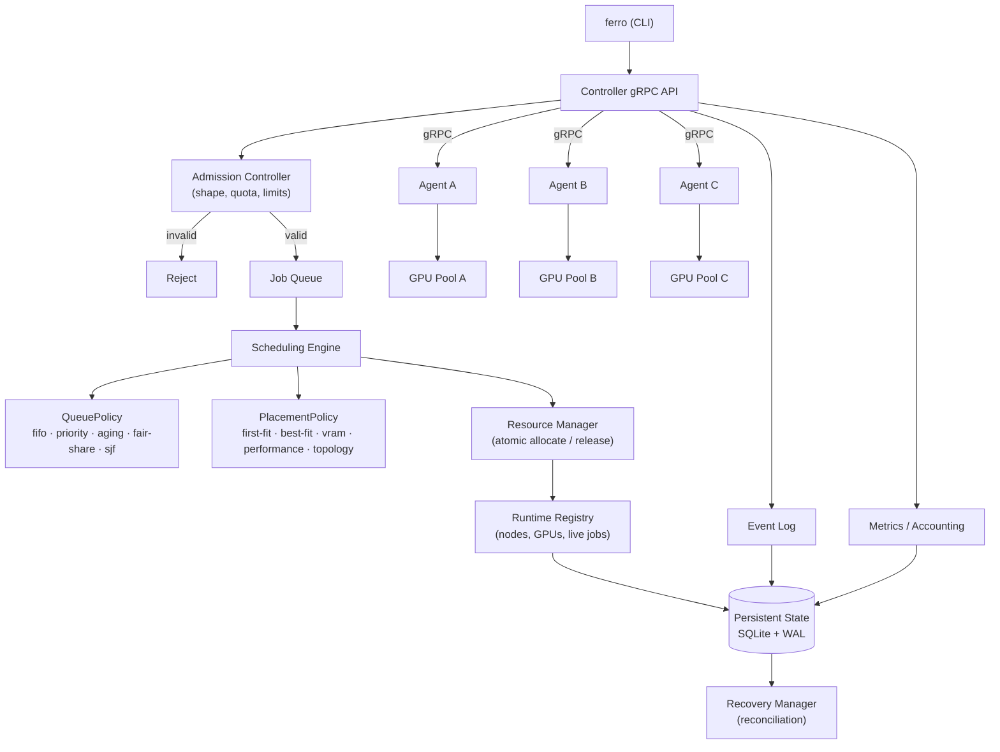

# FerroGrid — OS Term Project Roadmap

Companion to [`current_state.md`](current_state.md), which records what exists.
This document records **what to build, in what order, and what must be true
before moving on**.

Repositioning, for the avoidance of doubt: FerroGrid is *a lightweight
distributed operating-system-inspired resource manager for heterogeneous GPU
clusters*. PyTorch, FSDP2, NCCL and Mojo are the **workload**, not the subject.

---

## 1. The two structural blockers ✅ *resolved in Phase 1*

Nothing in the evaluation plan was possible until these were fixed. They were
not features; they were preconditions.

### B1 — The scheduler is not importable ✅

`ferro-controller` is a binary-only crate (no `lib.rs`). No integration test,
benchmark, or simulator outside that binary can link the scheduling code. §53
demands that the simulator and the real cluster **share one scheduler core**;
today they could not, so a simulator would inevitably become a second
implementation — precisely what §90.2 forbids.

### B2 — Plan and reserve are not atomic ✅

`submit_job` reads the cluster, plans, and reserves in three separate critical
sections, and `reserve` overwrites `allocated_job_id` unconditionally
(`registry.rs:482`). Two concurrent submissions can both be handed the same GPU.

The agent prevents actual double-execution — it re-validates every launch
against its own allocation table and rejects conflicts
(`ferro-agent/src/service.rs:69-73`) — so this is not a "two jobs on one card"
bug. What it *is*: a lost update that makes the controller release the wrong
job's GPUs, report running cards as free for up to one heartbeat, and fail
subsequent placements spuriously (`current_state.md` §5.2).

That still matters for this project. Every utilisation, waiting-time and
fairness number in Phase 4 is read off the controller's view of who holds what.
A policy cannot be evaluated on a ledger that loses writes under concurrency.

**Both were fixed in Phase 1, before a single new policy was written.**
B1 by adding `crates/ferro-sched` and `ferro-controller/src/lib.rs`; B2 by
`Registry::reserve_exact`. See [`progress.md`](progress.md).

---

## 2. Target architecture



### 2.1 Crate layout

| Crate | Role | May depend on |
|---|---|---|
| **`ferro-sched`** *(new)* | Policy traits and every policy. **Pure, synchronous, no I/O, no tokio, no gRPC clients.** | `ferro-proto`, `serde`, `thiserror` |
| `ferro-controller` | Registry, admission, dispatch, persistence, RPC. Gains a `lib.rs`. | `ferro-sched`, tonic, tokio, … |
| **`ferro-sim`** *(new, Phase 4)* | Deterministic simulator + workload generator + experiment runner | `ferro-sched` only |
| `ferro-agent`, `ferro-cli`, `ferro-gpu`, `ferro-proto` | unchanged in role | |

A separate `ferro-sched` crate is preferred over merely adding `lib.rs`, because
it makes the purity constraint **structural**: a policy physically cannot open a
socket or await a lock if the crate does not depend on tokio. That is what
guarantees the simulator and the cluster run the same code.

### 2.2 The two questions, separated

```rust
// "Which job runs next?"
pub trait QueuePolicy: Send + Sync {
    fn name(&self) -> &'static str;
    /// Best-first. MUST be a total order: equal inputs ⇒ identical output.
    fn rank(&self, jobs: &[QueuedJob], ctx: &SchedulingContext<'_>) -> Vec<QueueRanking>;
}

// "Where should it run?"
pub trait PlacementPolicy: Send + Sync {
    fn name(&self) -> &'static str;
    fn place(&self, req: &PlacementRequest, ctx: &SchedulingContext<'_>)
        -> Result<PlacementDecision, ScheduleError>;
}
```

Both return **scored, explainable** results rather than bare answers, so §13 and
§46 fall out of the design instead of being bolted on:

```rust
pub struct QueueRanking  { pub job_id: String, pub score: f64,
                           pub components: Vec<(&'static str, f64)> }
pub struct PlacementDecision { pub plan: JobPlan, pub score: PlacementScore,
                               pub reasons: Vec<String> }
```

### 2.3 Three invariants the design enforces

1. **Time is injected, never read.** `SchedulingContext { now: i64, … }`. No
   policy calls `SystemTime::now()`. Aging and fair-share are therefore
   deterministic, testable, and replayable at simulator speed.
2. **Policies are pure and synchronous.** The reason is §53: the simulator and
   the real cluster must run *one* scheduler core, and a policy allowed to do
   I/O either cannot run offline or has to be stubbed there — which is the
   second implementation §90.2 forbids. Purity also keeps every policy call
   cheap enough to sit on the submit path, and keeps §79 satisfied by
   construction: there is no `await` to hold a lock across.
3. **Determinism on equal inputs** (§90.9). Every comparator chain terminates in
   a total tiebreak — the existing code already does this, and the trait
   contract makes it a requirement rather than a habit.

### 2.4 Reserve becomes a compare-and-swap, not a longer lock

The first draft of this design put the placement call *inside* the registry's
critical section, so plan-and-reserve would be one lock acquisition. An
independent review (§2.6) pushed back, correctly: that fixes the race by
serialising the dispatcher, which is the wrong direction — `run_queue` currently
plans every queued job with no lock held, and moving placement under the lock
would serialise all of them for no reason.

The adopted fix keeps placement outside the lock and makes **reserve itself
check its own precondition**:

```rust
// registry.rs — the lock is held only for the check-and-set, no await inside
pub async fn reserve_exact(&self, plan: &JobPlan, job_id: &str)
    -> Result<(), ReserveConflict>
```

For every GPU in the plan, verify `allocated_job_id.is_empty()`; if any is
already taken, take **none** of them and return `ReserveConflict`. The caller
(`submit_job` or `run_queue`) re-plans against a fresh snapshot and tries again,
bounded by a small retry count.

This is a compare-and-swap against the real state rather than against a version
counter. A version counter was the reviewer's suggestion, but any node's
heartbeat would bump a global version every ~3 s per node, so retries would fire
constantly on a busy cluster for changes that do not affect the plan at all.
Checking the actual GPU ownership is immune to that churn.

It also fixes the follow-on bug in `current_state.md` §5.2 directly: because a
conflicting reserve is now all-or-nothing, job B never takes ownership of job
A's cards, so `release_if_done(B)` can never clear them.

Authority does not move. The agent remains the real allocator and keeps its
launch-time re-validation (`ferro-agent/src/service.rs:69-73`); the controller's
table stays soft state reconciled from heartbeats. The fix only stops that soft
state losing writes.

### 2.5 What the contexts carry

**Revised during Phase 1.** The design first gave both traits one shared
context. Implementation showed that queue ordering needs only the jobs and the
clock -- and that letting it depend on what is free right now would let the
position a user was quoted disagree with the order the dispatcher serves. So
there are two:

```rust
pub struct QueueContext { pub now: i64 }   // + usage in Phase 2
```

Placement keeps the wider snapshot:

The purity constraint only works if the snapshot is rich enough that a policy
never *wants* to do I/O. That means the context is not a vague catch-all — it is
a specified set:

```rust
pub struct SchedulingContext<'a> {
    pub now: UnixSeconds,              // injected, never read from the clock
    pub nodes: &'a [NodeState],        // incl. link_mbps and measured net pairs
    pub running: &'a [RunningJob],     // for preemption eligibility, load terms
    pub usage: &'a UsageSnapshot,      // per-user GPU-seconds, for fair-share
    pub quotas: &'a QuotaTable,        // read-only view, for admission hints
    pub config: &'a SchedulerConfig,   // all weights and intervals
}
```

Everything a quota check, a blacklist or a preemption decision needs is a field
here, gathered once by the caller before the policy runs. If a future feature
genuinely needs data that cannot be snapshotted, that is a signal it belongs in
**admission control** — which runs before the queue and *may* be async — not in
a scheduling policy.

### 2.6 Independent review: what was accepted and rejected

The design above was reviewed by an external model instructed to disagree. Three
objections were raised; recording the adjudication matters, because "why is the
scheduler shaped like this" is a question the term project has to answer.

| Objection | Verdict | Reasoning |
|---|---|---|
| **Placement under the mutex serialises the dispatcher; use optimistic versioning instead** | **Accepted**, with a change | The criticism is right and the design changed (§2.4). The specific remedy was not: a global version counter churns on every heartbeat. Compare-and-swap on actual GPU ownership is both simpler and immune to unrelated updates |
| **Pure + synchronous policies foreclose quota checks, blacklists, preemption eligibility, external lookups** | **Rejected** | §53 requires the simulator and the cluster to run *one* scheduler core, and §90.2 forbids a second implementation. A policy permitted to do I/O either cannot run in the simulator or must be stubbed there — which *is* the second implementation. The examples given are not counter-examples: quota is admission control (before the queue, may be async); blacklists are node attributes; preemption eligibility is running-job state. All are snapshot fields (§2.5) |
| **`QueuePolicy` should be stateful (`&mut self`, `record_start`/`record_end`) instead of taking a context** | **Rejected** | Fair-share usage is *cluster* state, not policy-private state: it must be persisted (§20, §50), queried by `ferro usage` (§19), and survive a policy switch (§67). Owning it inside the policy creates a second source of truth (§90.3) and makes hot-switching lose the ledger. The legitimate part of the objection — that the context was underspecified — is addressed by §2.5 |

One further review point is carried into Phase 1 as an open question rather than
a decision: the registry uses `tokio::sync::Mutex` although no code path awaits
while holding it, so `std::sync::Mutex` would be the more honest type. Changing
it is a separate, mechanical commit and should not ride along with the refactor.

## 3. Phases and gates

§85's minimum feature set does **not** include persistence. The critical path to
a defensible term project is therefore **Phase 1 → 2 → 3 → 4**; persistence and
recovery (Phases 5–6) are the §86 "strong target" and come after the evaluation
story is complete. Building persistence before the simulator would mean
measuring nothing for longer.

### Phase 0 — Baseline audit ✅ *(this document + `current_state.md`)*

**Gate:** all existing tests pass.
**Status:** met — 54 Rust + 19 Python tests pass. `cargo fmt --check` and
`cargo clippy -D warnings` do **not** pass (32 hunks / 17 lints, all mechanical
and pre-existing). Cleaning those is the first commit of Phase 1, so that the
§80 gate can actually detect a regression afterwards.

---

### Phase 1 — Scheduler refactor (no behaviour change) ✅ *complete*

| | |
|---|---|
| **Current behaviour** | One composite placement function (`scheduler.rs::plan`/`plan_auto`); FIFO order implicit in `registry.rs::queued_jobs`'s sort by `job_order` |
| **Files affected** | New `crates/ferro-sched/`; `ferro-controller/src/{lib.rs (new), main.rs, service.rs, registry.rs}`; `scheduler.rs` moves out |
| **Design** | §2 above. `plan`/`plan_auto` move **verbatim** behind `PlacementPolicy` as the default `performance` policy; the `job_order` sort moves behind `QueuePolicy` as `fifo` |
| **Data model** | New `QueuedJob`, `SchedulingContext`, `PlacementRequest`, `PlacementDecision`, `SchedulerConfig`. No change to `Job` or `Node` yet |
| **Protocol** | **None.** No `.proto` change in this phase |
| **Migration impact** | None visible to users; every CLI command and flag in `current_state.md` §2.6 keeps working |
| **Test plan** | All 54 existing tests move with the code and must pass unmodified · new: concurrency test that fires N parallel submissions and asserts no GPU is ever in two plans (this test **fails before** the B2 fix and passes after) · new: invariant test that a terminal job owns no allocations · new: test that a conflicting `reserve_exact` takes **none** of the requested GPUs |

**Gate:**
- `cargo test --workspace` green, **and** `cargo fmt --check` + `cargo clippy --workspace --all-targets -- -D warnings` green.
- Every scheduler test from Phase 0 passes **byte-identically unmodified** — this is the proof that behaviour did not change.
- The new concurrency test passes.
- `ferro-sched` has no `tokio`/`tonic-client` dependency.

---

### Phase 2 — OS scheduling algorithms ✅ *complete*

Queue policies, in the order they should be built:

| Policy | Adds | Notes |
|---|---|---|
| `fifo` | — | already done in Phase 1, the baseline |
| `priority` | `priority: u32` (0–100, default 50) on `SubmitJobRequest`; `--priority` on `ferro train` | ties broken by submission order, never by timestamp alone |
| `aging` | `effective = base + floor(wait_s / aging_interval) * aging_increment`, capped at `max_priority` | all three configurable; no scattered magic numbers |
| `fair-share` | per-user usage tracking; `score = α·priority + β·norm_wait − γ·norm_usage` | α, β, γ in a `FairShareConfig` struct |
| `sjf` *(experimental)* | `--estimated-duration`; **no fallback guess** — a job without an estimate is ordered by a documented, explicit rule, never by a fabricated duration | used to demonstrate long-job starvation, then to show aging fixing it |

**Protocol change:** `SubmitJobRequest` gains `priority`, `estimated_duration_s`,
`project` at **new field numbers only** (§78). Old clients omit them; proto3
defaults (0 / empty) must mean "unspecified", and `priority == 0` must therefore
be distinguished from "default 50" — use `optional uint32` or an explicit
`priority_set` companion, decided when implemented.

**Test plan:** per §5 — waiting job's priority increases; a newer high-priority
job overtakes; an old low-priority job eventually runs; ties are deterministic.
Plus Jain fairness index unit tests with known inputs.

**Gate:** unit tests per policy · fairness metric computed and tested · every
policy deterministic under repeated identical input.

---

### Phase 3 — Placement algorithms ✅ *complete*

Refactor the existing composite policy into named, selectable strategies:
`first-fit`, `best-fit`, `vram-aware`, `performance-aware` (today's behaviour),
`homogeneous`, `topology-aware`.

Two substantive additions beyond repackaging:

1. **Persist `ferro net` results** so measured pairwise throughput reaches the
   scheduler. Today it is printed and discarded (`current_state.md` §5.3). This
   is what makes §12 real rather than a restatement of the negotiated link speed.
2. **Unified cost function** (§13) with configurable weights, surfaced through
   `ferro explain <job>`.

**Gate:** deterministic placement tests per strategy; `ferro explain` prints the
score breakdown for a real decision.

---

### Phase 4 — Evaluation (the term project's actual contribution) ✅ *complete*

`crates/ferro-sim`: workload generator (Poisson arrivals, N users, job size
mix), deterministic simulator driving **the same `ferro-sched` policies**, and an
experiment runner emitting CSV + JSON under `outputs/benchmarks/`.

Metrics: average / p50 / p95 waiting time, turnaround, makespan, GPU
utilisation, throughput, Jain fairness index, starvation count, scheduler
latency, fragmentation.

Reproducibility (§56): every run records seed, cluster config, workload config,
scheduler config, git commit, timestamp. Nothing hard-coded into the README.

Workloads A–G per §51. One **real** GPU workload (§73) exists already
(`train_fsdp2.py`); add a lightweight GPU-burn / sleep job (§74) so demos do not
require a 30-minute model.

**Gate:** `./scripts/run_os_experiments.sh` produces `results.csv` and
`summary.csv` for FIFO / priority / aging / fair-share / SJF / backfill in one
command, from a clean checkout.

---

### Phase 5 — Persistence ✅ · Phase 6 — Recovery ✅ · Phase 7 — Advanced ✅ *backfilling + reservation*

Per the specification. SQLite with WAL; **ephemeral telemetry stays in memory**
(heartbeats, GPU utilisation samples, the 20,000-line log ring) and only durable
state is written (jobs, queue, history, users, usage, benchmarks, network
measurements, events). Recovery reconciles both directions — DB-says-running /
agent-says-missing **and** DB-says-pending / agent-says-running — and never
assumes the DB is right.

Phase 7 picks from backfilling, reservation, DRF, quota, multi-resource and
topology-aware by remaining time. Phase 8 stretch goals (preemption,
checkpointing, power/thermal, auth/TLS/RBAC) only if everything above is stable.

---

## 4. Research questions this plan answers

| | Question | Answered by |
|---|---|---|
| RQ1 | How do FIFO, priority, aging and fair-share affect waiting time and fairness in a shared GPU cluster? | Phase 2 + Phase 4 |
| RQ2 | How does heterogeneous GPU-aware placement affect throughput and utilisation? | Phase 3 + Phase 4 (and the existing `ferro bench` data) |
| RQ3 | Can persistent state and reconciliation let FerroGrid recover from controller failure without losing scheduling state? | Phases 5–6 |
| RQ4 | Can backfilling improve utilisation without significantly delaying large distributed jobs? | Phase 7 |

---

## 5. Standing rules for every phase

1. Do not rewrite FerroGrid. The telemetry, execution and CLI layers are good.
2. One scheduler implementation, shared by the cluster and the simulator.
3. One source of truth for state.
4. No hard-coded benchmark results; no fake scheduling for a demo.
5. Every new feature ships with a test.
6. Deterministic output for equal inputs.
7. Proto changes use new field numbers and keep old clients working.
8. Never claim an unimplemented feature works — including in the README, which
   is currently wrong about queueing and must be corrected.
9. After each phase, update `docs/os_term_project/progress.md` in the §91 format.
